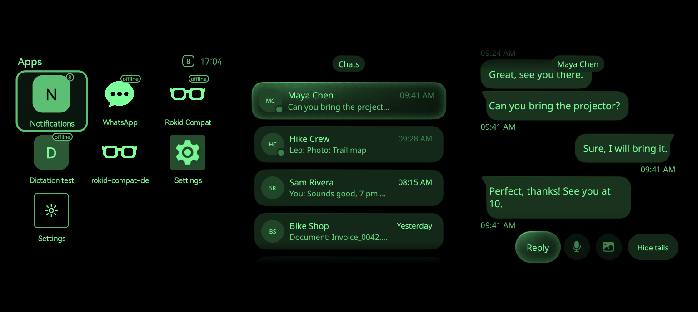
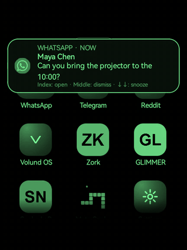
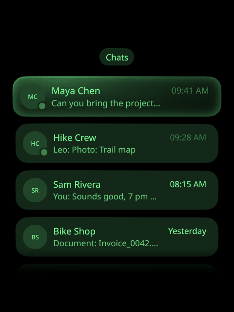
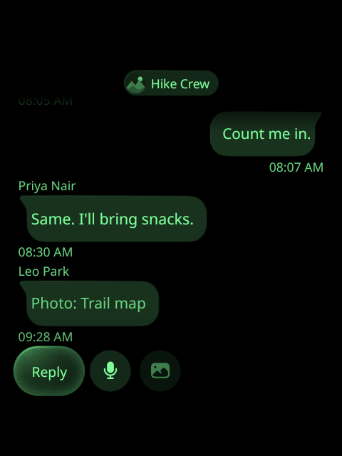
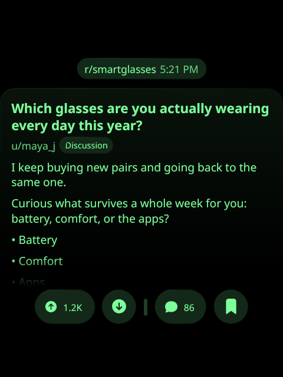
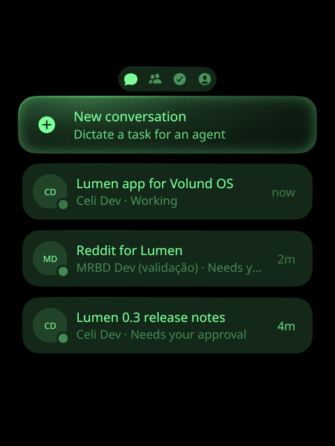

# Rokid Lumen

**Rokid Lumen** turns Rokid RG glasses into a small app platform driven by the **Meta Neural
Band**. A swipe of the thumb moves through a grid of web apps, an index tap opens, a middle tap
goes back. The apps are Meta Ray-Ban Display (MRBD) style web apps, offline packages or online
addresses. The phone's notifications, dictation and internet arrive through **Rokid Lumen
Companion**, an app on the phone.

Rokid Lumen is not affiliated with Meta or Rokid. "Rokid" names the glasses it runs on.

<!-- media: hero -->


<!-- media: demo -->


[The same 35-second clip as an MP4](docs/media/lumen-demo.mp4), recorded on the glasses with
`adb shell screenrecord` ([as the lens shows it](docs/media/lumen-demo-lens.mp4)). The band's
gestures are simulated (`SIMULATE`), and everything on screen is demo data: the example apps'
demo mode and simulated notifications.

> **Built on [R08 Access Bridge](https://github.com/Anezium/R08-Access-Bridge) by
> [Anezium](https://github.com/Anezium).** The glasses' input, navigation, settings screen and
> self-arm come from it, used under the Apache License 2.0. Thank you, Anezium.

## What is in the repository

| Part | What it is |
| --- | --- |
| `app/` | The glasses app, `dev.lumen.glasses`: the apps grid, the web app host (GeckoView 156 or the system WebView), the notification inbox and banner, the dictation and handwriting composer, and the accessibility service that connects to the band and drives the glasses. Rokid RG glasses, Android 12, a 480x640 monochrome green HUD. |
| `phone/` | Rokid Lumen Companion, `dev.lumen.companion`: the band's settings, notification forwarding, dictation engines, the Apps tab (arrange the grid, install by address, set an app's server URL or API key), and the hotspot and proxy that give the glasses internet. |
| `band/`, `rust/` | The Neural Band link, in Rust (`liblumen_band.so` over JNI), from [air-gestures](https://gitlab.com/896kb/air-gestures) and [kinesis](https://github.com/callbacked/kinesis). |
| `protocol/` | The messages between the glasses and the phone, sent over Rokid's CXR link. |

## How it fits together

```text
 Meta Neural Band --(Bluetooth L2CAP, Rust bridge)--> glasses: BandAccessibilityService
                                                         |  gestures -> D-pad, Enter, Back
                                                         v
                         apps grid, web apps (GeckoView / WebView), inbox, composer
                                                         ^
                       Rokid CXR link (through Hi Rokid) |  notifications, dictation,
                                                         |  settings, grid, hotspot offer
                                                         v
 phone: Rokid Lumen Companion --(local-only hotspot + HTTP proxy)--> internet for the glasses
```

- The band talks to the glasses directly, over the reverse-engineered protocol. Meta publishes
  no Android API for it (see [NEURALBAND.md](NEURALBAND.md)).
- The glasses and the phone talk over Rokid's own link, so there is no extra pairing. The
  messages are defined once, in `protocol/`.
- Web pages never go over that link: when the glasses need the phone's internet, they join a
  hotspot the phone opens for them.

## Features

- **Band control.** Swipes move, the index tap selects, the middle tap is Back. The middle
  double tap turns the screen off and on, the middle hold turns the controls off and on, and
  pinch and turn changes the volume (or navigates). The index double tap can be mapped to an
  action or an app.
- **Home with three tabs.** Notifications (the phone's notification inbox), Apps (the web
  apps and any native apps you add, three across in rows that scroll, the glasses' settings
  last, the focused app's icon bigger; you arrange them from the phone) and Controls (the
  glasses', band's and phone's batteries, volume, brightness, do not disturb, the Rokid's camera, gallery, music and settings, and the way back
  to the Rokid launcher).
- **Web apps.** Offline `.mrbd.zip` packages, served from a loopback server, and online HTTPS
  apps. Each app has its own origin and, on GeckoView, its own cookies and storage. Apps can
  declare settings (a server URL, an API key) that you fill in from the phone.
- **Notifications.** A banner over any app and an inbox grouped by app. Dismiss on the glasses
  (it clears on the phone too), snooze the banners for 15 minutes, hide the text.
- **Dictation and handwriting.** Enter on a text field opens a composer: dictate, or write with
  a finger on any surface through the band's own handwriting model. The phone transcribes the
  glasses' microphone with the engine you choose: the Android recognizer, OpenAI, ElevenLabs,
  Azure, or Vosk offline in English or Portuguese.
- **Internet through the phone.** When no saved Wi-Fi is in range, the companion opens a
  local-only hotspot and a proxy, and the glasses join it on their own.
- **The band on the phone.** The companion can take the band over and control the phone
  (media, volume, brightness, flashlight, screen gestures) with **gesture profiles** (Media,
  Navigation, your own) switched by a gesture, and its **handwriting keyboard**
  writes in any app's text field with the band. Either side hands it back.
- **Air Mouse.** An experimental cursor moved by the forearm, on the glasses, on the phone or
  on a computer, with the index pinch as a tap or a click. Every gesture on the glasses is
  mappable.
- **The band on a computer.** Through the phone, as its Bluetooth keyboard and mouse: scrolling,
  desktops, keys, media and writing with the band on a laptop, with profiles of its own and
  nothing to install there, and an experimental **Air Mouse** that moves the pointer with the
  forearm.

Details: [docs/features.md](docs/features.md).

## Apps

Web apps for Lumen, each in its own repository. They are unofficial and not affiliated with the
services they work with; each README lists what you need and the risks.

| App | What it does | What you need | Source | License |
| --- | --- | --- | --- | --- |
| **WhatsApp for Lumen** | Chats, photos, voice notes, reactions, replies by dictation, voice search; opens from a WhatsApp notification | An [Evolution API](https://github.com/EvolutionAPI/evolution-api) server you run | [beyondlevi/lumen-whatsapp](https://github.com/beyondlevi/lumen-whatsapp) | MIT |
| **Unofficial Telegram for Lumen** | The same screens for Telegram, straight to Telegram over MTProto (GramJS), no server | Your own `api_id` and `api_hash` from my.telegram.org | [beyondlevi/lumen-telegram](https://github.com/beyondlevi/lumen-telegram) | GPL-3.0 |
| **Reddit for Lumen** | Home, Popular, communities and inbox; posts, pictures and comments | Your Reddit session cookies (an optional Worker renews them) | [beyondlevi/lumen-reddit](https://github.com/beyondlevi/lumen-reddit) | MIT |
| **Instagram for Lumen** | Reels and Direct: likes, saves, comments, replies by dictation, voice messages | A small bridge you run at home ([instagrapi](https://github.com/subzeroid/instagrapi)) | [beyondlevi/lumen-instagram](https://github.com/beyondlevi/lumen-instagram) | MIT |
| **Calendar for Lumen** | Google Calendar: today and the next 7 days, an event with its guests, description and your reply, new events dictated or written with the band | Your own Google Cloud OAuth client and its refresh token (a script in the repository gets it) | [beyondlevi/lumen-calendar](https://github.com/beyondlevi/lumen-calendar) | MIT |
| **Unofficial TickTick for Lumen** | Every pending task by day; complete, view, edit, delete and add tasks, dictated or written with the band | Your TickTick API token (Settings › Account › API Token) | [beyondlevi/lumen-lists](https://github.com/beyondlevi/lumen-lists) | MIT |

Each one builds an offline package (`npm run package`, a `.mrbd.zip`); install it from the
companion's Apps tab (**Add**, or **Replace the package** to update) and fill in its settings
there. Its own *Demo mode* setting shows made-up data, as in the screenshots below. To write
your own: [docs/building-apps.md](docs/building-apps.md).

| WhatsApp | Telegram | Reddit | Volund OS (private) |
| --- | --- | --- | --- |
|  |  |  |  |

### Games

Played with the band, and offline: they need neither a server nor the phone's internet. Install
them the same way.

| Game | How it plays | Source | License |
| --- | --- | --- | --- |
| **Goat Climb** | A mountain goat leaps from ledge to ledge: swipe left, up or right to jump, and climb through five phases that keep getting harder | [beyondlevi/lumen-goat-climb](https://github.com/beyondlevi/lumen-goat-climb) | MIT |

## Install

Download both APKs from the [GitHub Releases](https://github.com/beyondlevi/rokid-lumen/releases)
page. Each release has `rokid-lumen-glasses-<version>.apk`,
`rokid-lumen-companion-<version>.apk` and `SHA256SUMS.txt`.

Install the companion on the phone. Its **Set up your glasses** page installs the glasses app
over Rokid's link, with no computer: authorize in Hi Rokid, turn on the phone's Wi-Fi, tap
**Install on the glasses**, then turn Lumen on in the glasses' Accessibility settings. The same
page prepares the glasses (the self-arm) and gives them the band's key: **Generate the key with
my Meta account** signs in on Meta's own page and claims a factory-reset band from the phone, as
kinesis and air-gestures do on a computer, or import a key you already have. Details in
[docs/getting-started.md](docs/getting-started.md). (adb still works: `adb install` both APKs.)

## Recommended use

- **Make Lumen your main screen.** Open it from Rokid Lumen's icon on the Rokid launcher, or map
  the index double tap to *MRBD apps* in the companion's Band tab; Back keeps you in it, and the
  Controls tab's last tile goes back to the Rokid launcher. Add the native apps
  you use to the grid from the companion's Apps tab, so everything is a swipe away.
- **Keep the screen on and turn it off with the band.** The middle double tap turns the HUD off
  and on again, as on Meta's glasses. With the screen off it is the only gesture that does
  anything, so nothing runs by accident.
- **Turn on band power saving** if you want the band quiet while the screen is off. The band
  then stops sending gestures, and only the glasses' button turns the screen back on.
- **Run the self-arm once.** Without it, a firmware force-stop leaves the band disconnected,
  and the glasses can't join the phone's hotspot. Read [docs/security.md](docs/security.md)
  first: it leaves ADB over TCP enabled.

## Documentation

- [Getting started](docs/getting-started.md): requirements, installing, pairing, the self-arm,
  and how to undo it.
- [Features](docs/features.md): gestures, the grid, notifications, internet, dictation, the
  companion.
- [Building apps](docs/building-apps.md): the developer guide for Lumen web apps.
- [Security](docs/security.md): the security model and the known open issues.
- [Roadmap](ROADMAP.md), [Changelog](CHANGELOG.md), [Contributing](CONTRIBUTING.md).
- [skills/lumen-app/SKILL.md](skills/lumen-app/SKILL.md): a skill for coding agents that build
  Lumen apps. [llms.txt](llms.txt) indexes the docs for language models.

## Build

You need the Android SDK (platform 37.2, which GeckoView 156 is built against) and NDK, JDK 17
or later, and Rust with the `aarch64-linux-android` target and `cargo-ndk`.

```sh
./build-rust.sh                  # the Rust bridge, into band/src/main/jniLibs
./gradlew assembleDebug          # both apps: app/ (glasses) and phone/ (companion)
./gradlew test lintDebug         # unit tests and lint
(cd rust && cargo test --workspace)
python3 scripts/check-english.py
```

`band/src/main/jniLibs` is not committed: run `./build-rust.sh` before the first Gradle build.
More in [CONTRIBUTING.md](CONTRIBUTING.md).

## Credits

- [air-gestures](https://gitlab.com/896kb/air-gestures) (MIT): the band link this project grew
  from (`band/`, `rust/`).
- [kinesis](https://github.com/callbacked/kinesis) (MIT): the Neural Band protocol, ported to
  Rust in `rust/band-core/`, and the Meta sign-in and band claim, ported to Kotlin in the
  companion (`phone/.../meta/`).
- [R08 Access Bridge](https://github.com/Anezium/R08-Access-Bridge) by Anezium (Apache-2.0):
  the glasses' input, navigation, settings screen and self-arm are derived from it; it showed
  that the Rokid glasses can be driven through an accessibility service and armed from the
  glasses themselves. The derived files are listed in [NOTICE](NOTICE).
- [rokid-r08-wake](https://github.com/hacha/rokid-r08-wake) by hacha (MIT): the loopback
  self-arm technique the accessibility watchdog recovery is built on.
- [Rokid Nexus](https://github.com/Anezium/Rokid-Nexus) (Apache-2.0): the notification text
  extraction and sensitive content detection, the design of the notification relay, and the
  dictation engines.
- The [Meta Ray-Ban Display UI Toolkit](https://github.com/facebook/meta-ray-ban-display-ui-toolkit-web)
  (Apache-2.0): the glasses' screens follow its design tokens. No toolkit code is included.
- [GeckoView](https://mozilla.github.io/geckoview/) (MPL 2.0),
  [Vosk](https://alphacephei.com/vosk/) (Apache-2.0), [Noto Sans](https://notofonts.github.io/)
  (OFL 1.1), kadb, OkHttp and the other libraries listed in [NOTICE](NOTICE).

## License

MIT, see [LICENSE](LICENSE). Copyright (c) 2026 Levi Nóbrega. Third-party code and its
licenses are listed in [NOTICE](NOTICE); the code derived from R08 Access Bridge is under the
Apache License 2.0 (its files say so in their headers).
