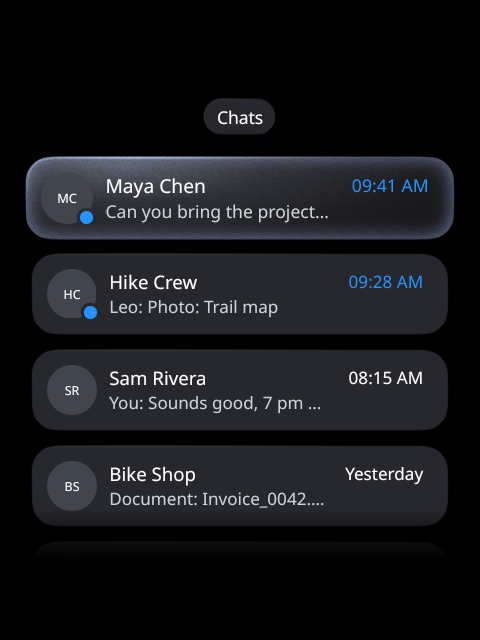
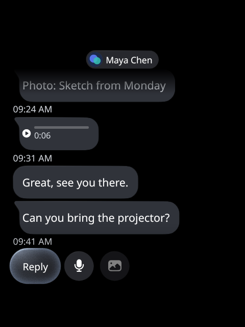
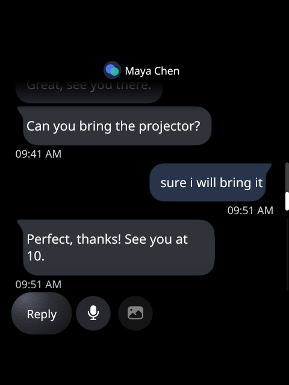

# Building apps for Rokid Lumen

Lumen runs web apps written for Meta Ray-Ban Display (MRBD): a small web page, driven by
arrow keys, Enter and Back, on a 600x600 CSS pixel viewport. This guide covers what the Lumen
host gives an app, how to package one, and how to test it on the glasses. An app written for
Lumen this way also stays a plain web app.

For coding agents there is a condensed version: [skills/lumen-app/SKILL.md](../skills/lumen-app/SKILL.md).

## The screen

- **The viewport is 600x600 CSS pixels**, shown on the HUD's 480x480 square (the RG glasses'
  display is 480x640; the app gets the square). Design for 600x600 and don't scroll the page
  itself: move focus instead.
- **The display is additive and monochrome green.** Black is transparent: the wearer sees the
  world through it. Bright, filled areas cover the view and wash out. Use a black background,
  light text and thin outlines, and keep filled panels small. GeckoView covers the page with
  black until its first paint, so a white page doesn't flash.
- Meta's [UI Toolkit for Meta Ray-Ban Display](https://github.com/facebook/meta-ray-ban-display-ui-toolkit-web)
  (React; components, design tokens, focus navigation) is the reference design. Lumen's own
  screens follow its tokens.
- **A hidden app is suspended.** The display goes off after a couple of minutes without input
  (the wearer's setting). When it does, or another screen covers the app, the page turns hidden
  (`visibilitychange`) and GeckoView suspends it: timers, animations and network wait until it's
  visible again, and it comes back as it was. The phone's internet stays for 5 minutes, then
  goes until the app is back. Refresh what's stale (a feed, a chat) on `visibilitychange` and
  retry a request that failed meanwhile. Android may still end the page's process (Lumen then
  loads the page again when it's shown), so keep what the wearer was doing (the open chat, the
  post) in the URL or in storage.
- **Animations run at 30 fps**, and an animated GIF plays once.
- **A `<canvas>` can come back reset.** While the display sleeps, Android may end GeckoView's
  GPU process. The page lives on, but a 2D canvas comes back with its context at the defaults:
  no transform, no fill or font. A scale set once at load is gone, and the drawing comes back
  too big and cut. Set the transform and the styles at the start of every frame (and redo the
  sizing on `contextrestored`).

## Input

The band never reaches the page as a pointer. The glasses turn its gestures into keys:

| Band | The page gets |
| --- | --- |
| Swipe up, down, left, right | `keydown`/`keyup` for `ArrowUp`, `ArrowDown`, `ArrowLeft`, `ArrowRight` |
| Pinch and turn, when set to Navigation | `ArrowUp` and `ArrowDown` |
| Index tap | `Enter` (on a focused text field, Lumen's keyboard instead: below) |
| Middle tap | Back (below) |

Other gestures (the middle double tap, the middle hold, a mapped index double tap, volume)
never reach the page.

**Make every control focusable and give it a visible focus state.** Handle the arrow keys
yourself: move focus through a list, a grid, between buttons (`element.focus()`), and keep the
focused element in view. Activate on `Enter`: a `click` handler on a focused `<button>` or `<a>`
fires on Enter, a `click` on a `<div>` doesn't, so use real buttons or handle `keydown`.

### Back

The middle tap is MRBD's Back, done by the shim in three steps:

1. The page gets an `Escape` `keydown` and `keyup`, sent to `document.activeElement`.
2. If a `keydown` handler called `preventDefault()`, or the page's address changed within
   150 ms, Back is done: the page handled it (closed a dialog, went up a level).
3. Otherwise the app goes back in its history, or closes when there is none.

So: call `event.preventDefault()` on `Escape` when you handle it yourself, and don't call it
when you want the default (history, then close). A page off the app's own origin gets no say:
its Back always goes to history, then close.

### Text fields and dictation

A real text field gets **Lumen's keyboard**, the glasses' input method, as it would get a phone's
keyboard: `<input>` (`text`, `search`, `email`, `url`, `tel`, `number`, `password`, or no type),
`<textarea>` and `contenteditable`, on both engines. There is nothing to call and no shim
message to handle: a field that takes text is all an app needs.

- **Focus alone shows only a hint**, under the app's square ("Index: dictate, write or phone").
  It never covers the page, and the page isn't resized or panned for it.
- **The index tap on the focused field opens the keyboard's panel** instead of reaching the page
  (MRBD's composer, as before): the person dictates (the phone transcribes the glasses'
  microphone), writes with the band, or types on the phone's keyboard. A password field offers
  writing and the phone only, and its text shows masked.
- **The text arrives as typing does**: the engine's own `beforeinput` and `input` events, the
  value updated as it comes (a dictated phrase at a time, a written letter at a time, or the
  phone's whole text). React and other frameworks that track an input's value see it. `change`
  fires as in any browser, when the field loses focus or on Enter.
- **Enter is the field's**: once the field has text, the panel offers its Enter action as a button
  (the field's `enterkeyhint`, else the form's: *Search*, *Send*, *Go*, *Next*, *Done*), and the
  phone keyboard's Send is the same. The page gets it as an `Enter` key (`keydown`, `keyup`), as
  from any keyboard, so a form submits. The band's own index tap on a focused field never reaches
  the page: use the field's Enter (or a separate button) to submit.

The page never gets the microphone or the band. Don't build an on-screen keyboard, and don't
expect text on focus alone. On a focused field the arrows still reach the page (the band's
swipes move on, the middle tap is Back).

## What the host adds to the page

Lumen injects a shim (`app/src/main/assets/mrbd-shim.js`) before the app's own scripts. It
fills in what MRBD's runtime offers and the engines lack, and adds one Lumen API. Each part is
added only when the page doesn't have it already, and only where the host bridge exists:

| API | What it does |
| --- | --- |
| `window.lumen.config.get()` | Resolves to `{key: value}`: the app's settings, set from the phone. A key that isn't set is missing. |
| `window.lumen.config.onChange(cb)` | Calls `cb(values)` whenever the phone changes a setting while the app is open. Returns a function that removes `cb`. |
| `navigator.mediaDevices.getUserMedia({audio: true})` | A `MediaStream` from the glasses' microphone, live; `MediaRecorder` and Web Audio work on it as in any browser (see [Audio](#audio)). A video request fails with `NotFoundError`. |
| `SpeechRecognition`, `webkitSpeechRecognition` | The Web Speech API's recognition, on the glasses' dictation (see [Audio](#audio)). |
| `window.lumen.audio.record(options)` | Records the glasses' microphone (see [Audio](#audio)). |
| `window.lumen.audio.transcribe(blob, options)` | Transcribes an audio with the dictation engine chosen in the companion (see [Audio](#audio)). |
| `navigator.install(url, {name})` | Asks the glasses to add the online app at `url` (default: the current page). The wearer confirms on the glasses. |
| `navigation.canGoBack` | Whether there is history behind the page. Added only when the engine has no Navigation API: an `EventTarget` with no current entry, so React DOM 19 uses its History API path. |
| `speechSynthesis`, `SpeechSynthesisUtterance` | Added when the engine has none (the system WebView): speaks through Android's TextToSpeech. One voice (`Android TTS`), `speak()` queues, `cancel()` stops, and `start`, `end` and `error` events fire; `pause()` and `resume()` do nothing. |
| `DeviceOrientationEvent.requestPermission()`, `DeviceMotionEvent.requestPermission()` | Resolve to `'granted'`, for code written for MRBD's permission prompt. |

Feature-detect before use (`if (window.lumen)`), so the same build runs in a desktop browser.

```js
const settings = window.lumen ? await window.lumen.config.get() : {};
const server = settings['server.url'] || 'https://example.com';
window.lumen?.config.onChange((values) => reconnect(values['server.url']));
```

### Audio

The Rokid firmware silences a third-party app's microphone on the glasses, so Lumen records on
the phone: the companion takes the glasses' microphone over Rokid's link, as the dictation
does. Pages reach it in two ways.

**The standard APIs**, so code written for a browser runs here unchanged:

- `navigator.mediaDevices.getUserMedia({audio: true})` resolves to a `MediaStream` fed live
  (16 kHz PCM from the phone in 100 ms pieces, a few hundred ms behind). `MediaRecorder`
  (`audio/ogg` on GeckoView, `audio/webm` on the system WebView), `AudioContext` sources and
  analysers work on it; stopping the track gives the microphone back. No camera:
  `{video: true}` fails with `NotFoundError`. `enumerateDevices()` lists one `audioinput`.
- `SpeechRecognition` (and `webkitSpeechRecognition`): `start()`, `stop()`, `abort()`,
  `continuous`, `interimResults`, and the `start`, `result`, `error` and `end` events, served
  by the dictation engine chosen in the companion (its language, not `lang`).

The same code on Meta Ray-Ban Display: as of 2026-10 its browser gives web apps no microphone
(`getUserMedia` reportedly throws `NotFoundError` there), so an app that handles that error
(hides its voice button, say) runs on both.

**`window.lumen.audio`**, Lumen's own, for what the standards don't cover (transcribing an
audio the page already has) or a ready-made voice note: it hands the page an Ogg Opus voice
note (mono, 16 kHz). It also transcribes an audio
the page passes, with the dictation engine chosen in the companion (Vosk, Android or a cloud
engine), at the audio's own pace. One recording, live stream, recognition or transcription at a time, never during a
dictation. Files cross Rokid's link in acknowledged pieces, which takes a few seconds.

```js
const audio = window.lumen?.audio; // absent on older Lumen versions and in a desktop browser

// Record: resolves once the microphone is on.
const recording = await audio.record({ maxMs: 120000 }); // 2 minutes at most, the default
// onLevel and onEnd can also go in the options, so no event comes before they're set.
recording.onLevel = (level, elapsedMs) => meter(level); // 0..1, about 5 times a second
recording.onEnd = (reason, result, error) => {}; // 'max' (result has the audio) or 'error'
const { blob, mimeType, durationMs } = await recording.stop(); // or recording.cancel()
// stop() after onEnd answers the same way again (the result, or the error); cancel() after
// the end does nothing. durationMs is the audio's length. There is no permission prompt.

// Transcribe: anything Android decodes (Ogg Opus at any rate, as WhatsApp and Telegram send it,
// MP3, M4A/AAC, WAV…); up to 5 MB and 5 minutes. The language is the companion's dictation
// setting (options.language is passed along; engines that pick the language ignore it).
const { text } = await audio.transcribe(blob, { onPartial: (soFar) => show(soFar), signal });
```

Failures are `Error`s with a `code`: `busy` (another recording, transcription or dictation),
`no-phone` (no link to the phone), `unavailable` (the phone couldn't get the microphone),
`too-large`, `unsupported-format`, `no-speech`, `engine` (the engine's message in `message`),
`cancelled` and `timeout`; `code` is always set. A recording's `onEnd('error')` gets
`unavailable` (the phone lost the microphone or couldn't encode) or `timeout` (the glasses
stopped hearing from the phone).

**The host bridge answers the app's own origin only.** An offline app's origin is its loopback
server (`http://127.0.0.1:<port>`), an online app's is the origin of its URL. A page on any
other origin gets no settings, no install, no speech, no audio and no say on Back; on GeckoView,
the HTTPS page an online app shows on another site (a Google sign-in page in a YouTube app) gets
the band navigation, nothing else. Typing needs no bridge: Lumen's keyboard types into any
page's fields, that sign-in page's included.

## The manifest

Put a web app manifest at the package's root, as `manifest.webmanifest` (or `manifest.json`).
Lumen reads these fields and ignores the rest:

| Field | Use |
| --- | --- |
| `id` | The app's identity on the glasses. A package with the same `id` updates the installed app and keeps its port, its data and its settings. Without it, the package's file name is used. |
| `short_name`, else `name` | The name in the grid. Without either, the file name. |
| `version` | Shown on the install confirmation ("Offline package · version 1.2.0"). |
| `start_url` | In a package without `index.html`, an absolute `https://` address makes it an online app ([below](#online-app-packages-and-site-scripts)); otherwise ignored. |
| `icons` | The grid's icon: the largest PNG (`type` `image/png`, or no type), by the width in `sizes`. Its `src` must be inside the package. |
| `lumen_internet` | `true` if the app needs the internet. It opens at once, and the internet comes up behind it (the phone's when the glasses have none). |
| `lumen_config` | The settings the app needs, filled in from the companion's Apps tab. |
| `lumen_notifications` | The phone notifications the app opens: an open notification on the glasses offers the app's icon first, and opens the app at the page it names. |

Each `lumen_notifications` entry is `{packages, open}`:

- `packages`: the phone apps whose notifications it takes (Android package names).
- `open`: the page to open, a path of the app (`/…`), with placeholders filled from the
  notification and URL-encoded: `{shortcut}` (the conversation's shortcut id on the phone;
  WhatsApp's is the chat's JID, Telegram's `ndid_<dialog id>`), `{tag}` (the notification's tag
  on the phone; Reddit's names the post, as in `agg:t2_…:t3_<post>:3`), `{title}`, `{package}`.
  When a placeholder it uses is empty,
  or without `open`, the app opens on its start page. A single-page app's route works: the
  glasses serve `index.html` for any path that isn't a file.

```json
"lumen_notifications": [
  { "packages": ["com.whatsapp", "com.whatsapp.w4b"], "open": "/chat/{shortcut}" }
]
```

Offline packages only for now: an online app's manifest isn't read for it.

Each `lumen_config` entry is `{key, label, type, optional}`:

- `key`: the name in `window.lumen.config.get()`.
- `label`: what the companion shows (default: the key).
- `type`: `text` (the default), `url` (must start with `https://` or `http://` when set), or
  `secret`. A secret is kept on the glasses only: the companion shows whether it's set, never
  its value, and no log prints it.
- `optional`: `true` for a setting the app works without (default `false`). The companion lists
  every empty setting that is not optional as missing for the app to work.

Values are trimmed; setting an empty value clears it.

```json
{
  "id": "com.example.notes",
  "short_name": "Notes",
  "version": "1.2.0",
  "icons": [{ "src": "icon-192.png", "sizes": "192x192", "type": "image/png" }],
  "lumen_internet": true,
  "lumen_config": [
    { "key": "server.url", "label": "Server URL", "type": "url" },
    { "key": "server.key", "label": "API key", "type": "secret" }
  ]
}
```

Online apps added by address don't use the Lumen fields: their name is the one given when
they're added (or their host), they always use the internet, and their icon is fetched once
from their web manifest (or their `apple-touch-icon`). An online app can also come as a package,
which does use them: see [Online app packages and site scripts](#online-app-packages-and-site-scripts).

## Packaging an offline app

A package is a zip named `<anything>.mrbd.zip`, holding a built site: `index.html` and the
manifest at the root of the zip, or under one top-level folder (a zipped `dist/`). A Vite
build works as it is:

```sh
npm run build
(cd dist && zip -r ../notes.mrbd.zip .)
```

Limits and rules:

- At most 200 MB unpacked and 5,000 files. Paths that leave the package are refused.
- The package is unpacked in the glasses app's private storage and served on
  `http://127.0.0.1:<port>`, a port of its own (from 47100 up, never given out twice, even
  after an app is removed, so a new app can't inherit an old one's storage).
- The server answers `GET` and `HEAD`. A path without a file extension that isn't a file gets
  `index.html`, so client-side routes work; a missing file with an extension is a 404.
  `index.html` and the manifest are sent `no-cache`, everything else `max-age=3600`.
- Use relative or root-relative URLs (`base: './'` or `/`). An offline app can't navigate to
  another origin: such a link opens nowhere, and a short notice says so. It can still fetch
  from the internet when it declares `lumen_internet`.
- Google Fonts links in the app's HTML, CSS and JavaScript are pointed at a bundled Noto Sans,
  the font MRBD's UI toolkit loads, so the app works with no network. Any other Google font
  family won't load offline: bundle it in the package.

### Installing a package

- **From a computer:** `scripts/push-webapp.sh notes.mrbd.zip` copies it into
  `/sdcard/Android/data/dev.lumen.glasses/files/webapps/` and opens the grid, which installs
  every package in that folder and deletes it there. (Settings > Web apps (MRBD) > Install
  packages does the same.)
- **From an HTTPS address, on the glasses:**

  ```sh
  adb shell am start -n dev.lumen.glasses/.InstallConfirmActivity \
    -a dev.lumen.glasses.INSTALL_PACKAGE -d https://example.com/notes.mrbd.zip
  ```

  The glasses download it, show what it is, and install only when the wearer selects
  Install.
- **From the phone:** companion, Apps tab, **Add > Offline package from a file** picks a `.zip`
  on the phone; the glasses join the phone's network, fetch it from the phone and check it
  (size and SHA-256). **Add > Offline package from a link** takes an HTTPS address instead. An
  offline app's details have **Replace the package (.zip)**, which updates that app only. The
  glasses install without asking again.

An update from adb or the phone keeps the app's saved settings. An update downloaded on the
glasses from another origin than the installed app's forgets its secrets, and the confirmation
says so: any package can claim an `id`.

## Online apps

An online app is an HTTPS address. Add one from the companion (Apps tab, **Add > Web app by
address**), from a page with `navigator.install()`, or with adb:

```sh
adb shell am start -n dev.lumen.glasses/.InstallConfirmActivity \
  -a android.intent.action.VIEW -d https://example.com/app/ --es name "My app"
```

An online app may browse anywhere over HTTPS, but only pages on its own origin get the host
bridge, and Back skips the others; the others' text fields work with Lumen's keyboard as any
page's do. It reaches the internet through a saved Wi-Fi or the phone
(see [features.md](features.md#internet-through-the-phone)), so it opens a few seconds later
when the glasses have to join the phone's hotspot.

## Online app packages and site scripts

An online app can come as a package too: a `.mrbd.zip` with no `index.html` whose manifest's
`start_url` is an absolute `https://` address (the manifest may sit at the root or under one
top-level folder; a package with its own `index.html` is always an offline app). It installs as an online app that opens `start_url`, and keeps
the package's files on the glasses: the manifest, the icon and the site scripts. It installs and
updates as any package does (adb, a link confirmed on the glasses, the companion), is known by
its manifest `id`, and takes `version`, `icons` and `lumen_config` as an offline package does.

When you already have an app added by address for the same site (`instagram.com` added from
the companion, say), the package takes it over: the new app keeps that app's cookies and storage
(its sign-ins) and its place in the grid, and the old entry goes. The same site means the start
page's host or a host its scripts change, a leading `www.` or `m.` aside; a copy of an app is never
taken over. The install confirmation shows it as an update ("Updates instagram.com").

What it may bring:

| Field | Use |
| --- | --- |
| `lumen_scripts` | Site scripts: JavaScript and CSS from the package that run in the pages of the sites they name, to make a site work with the band (Instagram's Reels, YouTube's player). |
| `lumen_gestures` | A gesture card: what the band does in the app, shown the first three times it opens. Any package may have one. |

```json
{
  "id": "cloud.bynd.lumen.site.instagram",
  "name": "Instagram",
  "version": "1.0.0",
  "start_url": "https://www.instagram.com/",
  "icons": [{ "src": "icon.png", "sizes": "192x192", "type": "image/png" }],
  "lumen_scripts": [
    { "matches": ["https://www.instagram.com/*"], "js": ["site/instagram.js"], "css": ["site/instagram.css"] }
  ],
  "lumen_gestures": {
    "title": { "en": "Gestures on Instagram", "pt": "Gestos no Instagram" },
    "rows": [
      { "gestures": ["down", "up"], "text": { "en": "Next reel · previous", "pt": "Próximo reel · anterior" } },
      { "gestures": ["index"], "text": { "en": "Pause or play", "pt": "Pausar ou tocar" } },
      { "gestures": ["middle"], "text": { "en": "Back", "pt": "Voltar" } }
    ]
  }
}
```

The rules for `lumen_scripts` (a package that breaks one is refused, with the reason):

- At most 8 entries, each `{matches, js, css}`: `js` and `css` are lists of files, at least one
  file in all. An entry's scripts run in their order (joined with a `;` line), and so do its
  style sheets.
- `matches` are `https://<host>/<path>` match patterns, as `https://www.instagram.com/*`. The
  host may start with `*.` (`https://*.youtube.com/*`) and needs a dot past it (no `*.com`). No
  other scheme, no `<all_urls>`, no port.
- Files are relative paths inside the package: no `..`, no leading `/`, nothing fetched from
  elsewhere. All the scripts and style sheets together: 1 MiB at most.
- Only an online package's scripts run; an offline package's `lumen_scripts` is ignored (its
  pages never leave its own origin).

How they run:

- In the page's own world (as the page's scripts, not an extension's isolated one), at
  `document_start`, before any script of the page and whatever its Content Security Policy, in
  the top frame only.
- Only while their app is in front: Lumen hands the app's scripts to its built-in extension when
  the app comes to the front and replaces them when another app does (an app without scripts
  clears them). The app's first page waits for them to be in place, 3 s at most.
- On GeckoView only: an app switched to the system WebView gets none.
- The install confirmation says so, in bold, with every site they name: "Changes the pages of
  www.instagram.com for the glasses and the band".
- The page API they use (`window.lumen.band`, `lumen.highlight`, `lumen.toast`, `lumen.click`,
  `lumen.nav`) and the band navigation every online app's site gets are in
  [site-scripts.md](site-scripts.md).

`lumen_gestures` is `{title, rows}`. Each row is `{gestures, text}`: `gestures` is a list of
`up`, `down`, `left`, `right` (swipes), `index` and `middle` (taps), drawn in a row of circles,
and `text` says what they do. Every text (the title too) is a string, or one per language
(`{"en": …, "pt": …}`): the device's language is picked (`pt` for both pt-BR and pt-PT), then
English, then the first one given. Up to 6 rows; unknown gestures are skipped. The card covers
the bottom of the screen the first three times the app opens, and the first band gesture only
closes it. An online app on GeckoView without a card shows a one-line hint of the band
navigation instead (the first three times, for 4 s).

## Engines

Each app runs on one of two engines, switched per app from the companion's Apps tab or on the
glasses (Settings > Web apps (MRBD)):

| | GeckoView (default) | System WebView |
| --- | --- | --- |
| Engine | Firefox 156, bundled with the app | Chromium 95, the firmware's, not updatable |
| How the shim arrives | A built-in WebExtension, at document start, top frame | At document start when the WebView supports it, else when the page starts loading |
| 600 CSS px viewport | Display density override | Laid out at 600 CSS px and scaled down to the HUD |
| Google Fonts to Noto Sans | Offline packages | Every app |
| Isolation between apps | A session context per app: its own cookies, storage and cache, deleted with the app | One cookie jar shared by every app on this engine; storage per origin |
| Host bridge | Only the app's top frame | The main frame's address is checked, so a cross-origin iframe inside the app's own page still reaches it |

**Target GeckoView**, and test on the WebView only if you need it. Chromium 95 predates a lot
of today's web platform: the Navigation API (the shim fills in `canGoBack`), CSS `:has()` and
container queries, CSS nesting, `structuredClone`, `Array.prototype.findLast` and dynamic
viewport units. If your app must run there, build for it (Vite `build.target: 'chrome95'`) and
avoid those features. Keep an app that signs in to something on GeckoView: the WebView shares
its cookies between apps.

## A complete example: WhatsApp for Lumen

*WhatsApp for Lumen* is an offline package that reads and answers WhatsApp chats through an
[Evolution API](https://github.com/evolution-foundation/evolution-api) server you run. It uses most of
what this guide describes: `lumen_config` for the server address, the instance and the API key
(a `secret`), `lumen_internet` to reach the server through the phone, D-pad focus on every
element, the index tap on the reply field for dictation, and Back to leave a conversation. Its source:
[beyondlevi/lumen-whatsapp](https://github.com/beyondlevi/lumen-whatsapp) (MIT).

The screenshots below come from its demo mode (fictitious chats, no server), set from the
companion with the app's own *Demo mode* setting.

<!-- media: whatsapp-chats -->




<!-- media: demo -->
[A 35-second video](media/lumen-demo.mp4) goes from a WhatsApp notification to this app: the
reaction, the chat, a dictated reply. Recorded with `adb shell screenrecord`, in demo mode.

## Testing on the glasses

- Install with `scripts/push-webapp.sh` and open the app from the grid.
- Logs (the system WebView's console messages appear under `BandWebView`; Gecko's console
  goes to logcat too):

  ```sh
  adb logcat -v time -s BandWebApp:D BandGecko:D BandWebView:D BandLocalServer:D BandKeyboardIme:D *:S
  ```

  `BandKeyboardIme` is Lumen's keyboard: the kind of each focused field and its Enter action,
  and the length of what goes into it (never the text).

- Debug builds of the glasses app enable GeckoView's remote debugging (Firefox's
  `about:debugging`). Release builds don't.
- Without the band, in a debug build: turn on **Settings > Band > Simulated band** and send
  gestures (`swipe_down`, `index_tap`, `middle_tap`, ...):

  ```sh
  adb shell am broadcast -a dev.lumen.glasses.SIMULATE --es gesture index_tap
  ```

- The glasses' Back and Escape keys run the same Back as the middle tap, and other keys go to
  the page: `adb shell input keyevent KEYCODE_ESCAPE`.
- Never force-stop the glasses app: the firmware drops its accessibility service and the band.
  `adb install -r` over it is safe.

## Security model, in short

- Each offline app has its own loopback origin, on a port never reused. Its server answers only
  requests addressed to `127.0.0.1:<port>` or `localhost:<port>` (a DNS-rebound name is
  refused) and sends `Cross-Origin-Resource-Policy: same-origin`, `X-Frame-Options: SAMEORIGIN`
  and `X-Content-Type-Options: nosniff`.
- On GeckoView each app has its own session context; on the WebView cookies are shared.
- The host bridge answers the app's own origin only (another site's HTTPS page in an online
  app gets the band navigation, nothing else), and the settings go only to a page on that origin.
- Lumen's keyboard, the glasses' input method, sees what is typed in every field, as any
  keyboard does; it keeps nothing, and logs no text.
- Installs from outside the phone are confirmed on the glasses.
- A package's site scripts run only in the `https://` sites it names, only while its app is in
  front, on GeckoView, and the confirmation names those sites.

The whole model and its open issues: [security.md](security.md).
