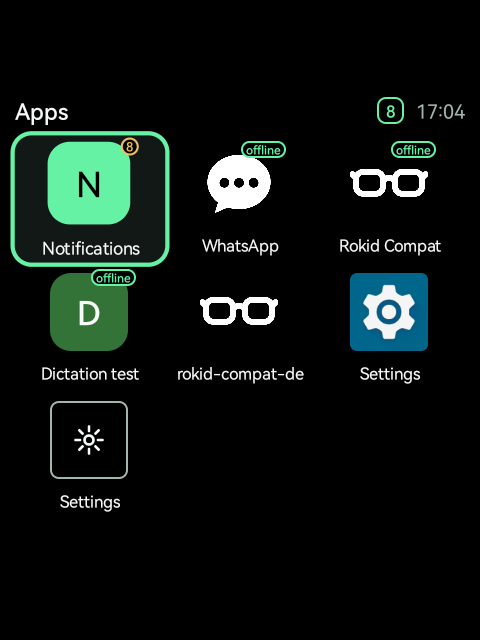
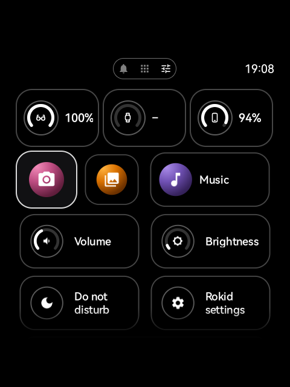
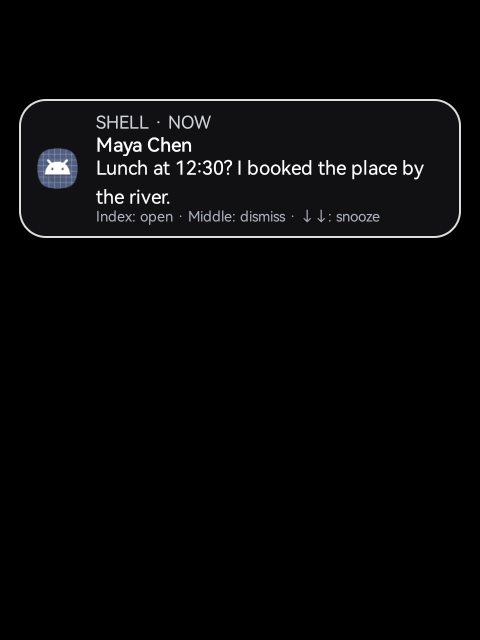
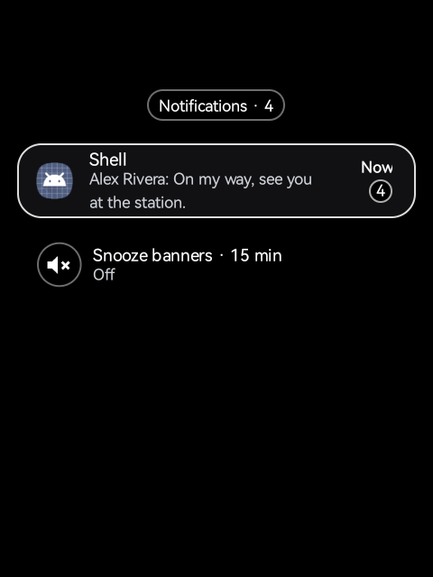
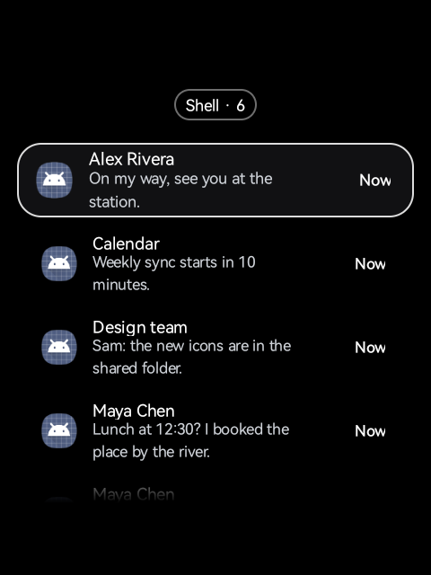
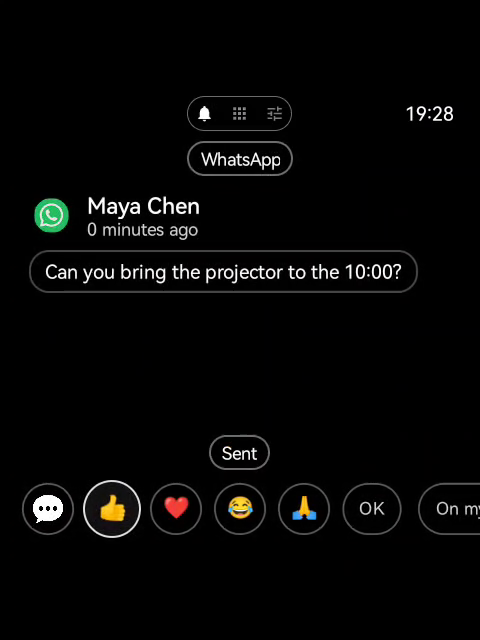
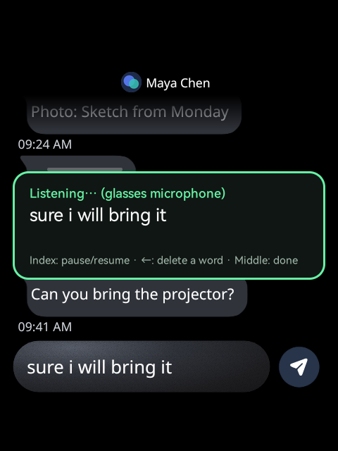
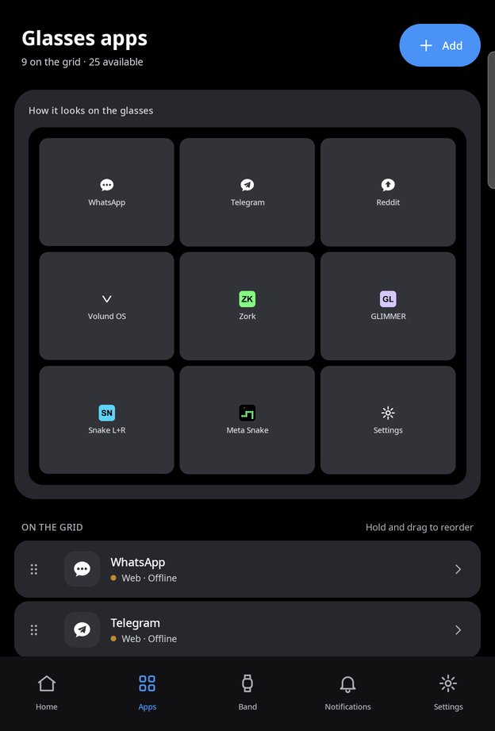

# Features

What Rokid Lumen does on the glasses and on the phone. To set it up, start with
[getting-started.md](getting-started.md).

## Band gestures

The band link recognises the gestures on the band itself (in the Rust bridge, `rust/bridge/`)
and hands the glasses an action name for each one. The navigation gestures are fixed:

| Gesture | Action | On the Rokid launcher and lists | In a web app |
| --- | --- | --- | --- |
| Swipe right or down | Next | Next app, next item | Arrow right, arrow down |
| Swipe left or up | Previous | Previous app, previous item | Arrow left, arrow up |
| Index tap | Select | Open the app, click the item | Enter |
| Middle tap | Back | Android Back | MRBD's Back (see below) |
| Middle double tap | Screen off and on | | |
| Middle hold | Controls off and on | | |
| Index double tap | Mappable, no action by default | | |
| Pinch and turn | Volume (default), Navigation, or No action | | |

- **The middle double tap turns the screen off and on**, as on Meta's glasses. With the screen
  off it is the only gesture that does anything; the others are ignored. A gesture right after
  the screen wakes is also ignored, so nothing runs blindly.
- **The screen goes off by itself** after 2 minutes without input (the companion's *Screen off
  after*: 30 seconds to 10 minutes, or Never, which keeps Rokid's own 10 days). Band gestures
  and the touchpad count as input, and an app that asks to keep the screen on (a video, the
  Rokid assistant) keeps it on.
- **The middle hold pauses the controls.** The band stays connected and still vibrates, but
  its gestures do nothing until the next hold. The settings screen shows *Band connected,
  controls off*.
- **The index double tap ships unmapped**, so an index tap is immediate: the bridge only waits
  to rule out a double tap when one is mapped. It can be set to: Back, Home, Play or pause,
  Launch app (any app with a launcher icon), MRBD apps (the grid), Rokid AI, Hi Rokid Shortcut
  (needs the self-arm), Take photo, Video toggle, AR screenshot, AR video toggle, or Use the
  band on the phone.
- **Pinch and turn** steps the volume up and down by default (the system volume panel shows
  it), or moves through lists and the launcher, or does nothing.
- **Navigation: Stable or Fast.** In Fast mode, three swipes in a row on the Rokid launcher
  start moving two apps per swipe.
- **Wrist**: as set on the band, left or right.

All of these are set from the companion's Band tab. The glasses' own Settings show a
**Gesture guide** and keep **Power saving** and **Forget band**.

The glasses' touchpad keys work everywhere too.

### Band power saving

The band streams motion (gyro and orientation, which only pinch and turn needs) only while the
glasses' screen is on, the controls aren't paused and pinch and turn does something. With **band power saving** on, it also stops its gestures: it
recognises nothing and doesn't vibrate, and only the glasses' button turns the screen (and the
band) back on. With it off, the middle double tap still wakes the screen.

The band's battery is read once a minute. A link that can't connect waits longer between
tries, up to 30 seconds.

### The band's battery on the Rokid launcher

While the Rokid launcher is in front and the band is connected, its battery shows on the
launcher's status row, left of the glasses' own: `+` while charging, amber at 20% or less. It
refreshes every 30 seconds. The companion's Band tab turns it off (*Battery on the Rokid
launcher*).

### How the band link works

Meta publishes no Android API for the band's gestures. The band core (`rust/band-core/`, a
port of [kinesis](https://github.com/callbacked/kinesis) by way of
[air-gestures](https://gitlab.com/896kb/air-gestures)) speaks the band's own Bluetooth protocol,
worked out by reverse engineering: GATT to find the input channel, then an L2CAP channel.
This is unofficial, and a band firmware update could change it. The research and its sources
are in [NEURALBAND.md](../NEURALBAND.md).

The apps talk to a `GestureDevice` (`band/src/main/java/dev/lumen/band/GestureDevice.kt`): start,
stop, pause, and a mapping string `gesture=action;...` built by `BandMapping`. Two implementations
exist:

- `BandLink`: the real band, through the Rust bridge.
- `SimulatedBand`: no band, in debug builds. Turn on **Band > Simulated band**, then send
  gestures with adb:

  ```sh
  adb shell am broadcast -a dev.lumen.glasses.SIMULATE --es gesture swipe_right
  ```

  Keys: `swipe_up`, `swipe_down`, `swipe_left`, `swipe_right`, `index_tap`, `index_double`,
  `middle_tap`, `middle_double`, `dial_up`, `dial_down`, `middle_hold`. It resolves the same
  mapping string, but not the bridge's timing (a single tap waiting out its double).

  With the real band still connected, a debug build also takes the resolved action itself,
  routed exactly as the band's (`--es command nav.down`; also `nav.up`, `nav.left`,
  `nav.right`, `nav.activate`, `nav.back`...), and a notification as if the phone sent it
  (`--es notify_title "Title" --es notify_text "Line one\nLine two"`). The home logs each
  command and what the page did with it (`adb logcat -s BandLauncher BandNotifPage`).

  For screenshots and demos, a simulated notification also takes `--es notify_app WhatsApp`,
  `--es notify_pkg com.whatsapp`, `--es notify_icon <a PNG's name in the app's external files
  folder>`, `--ei notify_time <minutes ago>`, `--ez notify_reply true` (quick replies, which
  answer "Sent" on the glasses alone), `--es notify_key <key>` and `--ez notify_alert true` (its
  banner shows). `--es grid_order <ids> --es grid_hidden <ids>` (comma-separated, as in
  `lumen_grid.xml`) arranges the apps grid.

An official API, if Meta publishes one, would be a third implementation of the same interface.

## The home

<!-- media: grid -->


Rokid Lumen's icon on the Rokid launcher opens the home, on top of the Rokid launcher. The time
sits at the top right, level with the tabs, with Wi-Fi's icon beside it while the glasses are on
Wi-Fi (the phone's hotspot for a web app included). It is the UI Toolkit's SubNavigationPager: a pill of three tabs at the top, **Notifications**,
**Apps** and **Controls**, over a page that slides from one to the next.

- **Notifications**: the phone's notification inbox (below). A dot on its tab icon says
  there's something new.
- **Apps**: three across, in rows that scroll vertically, each the toolkit's WebAppIcon look
  (the app's artwork in a squircle, its name under it). The focused app is the bigger one: its
  icon grows, with no outline. Web apps, offline and online, any **native apps** of the glasses
  you added from the phone (opened with their launch intent), and **Settings** last: the
  glasses' own settings (pairing, the self-arm, the band's key and log, the web apps list,
  accessibility and Bluetooth). Settings can't be hidden, so the glasses can't lock you out of
  them.

On the pill, left and right change the tab and down (or the index tap) goes into the page; up
from a page's top, or left (right) from its edge, comes back out, as the toolkit's focus
handoff does. The middle tap goes back a level, then to the tabs; it never leaves Lumen (the
Controls tab's Rokid launcher tile does). A banner's index tap opens the Notifications tab on that
notification.

### The Controls tab

<!-- media: controls -->


Right of Apps (right from the last app, or the tabs), the toolkit's control tiles. It scrolls.

- **Batteries**, at the top and not focusable: the glasses', the band's and the phone's, each a
  ring with the device's icon and its percentage (`+` while charging, `–` when unknown). The
  companion sends the phone's on the phone link (`nb.phone.event`) when it changes, when the
  glasses start and every five minutes; after 15 minutes without news it shows `–`.
- **Camera**, **Gallery** and **Music**: the Rokid launcher's own screens. Closing one comes back
  to Lumen (they live in the Rokid launcher's task, which would otherwise show its main screen).
- **Volume** and **Brightness**, with a ring for the level: the index tap starts adjusting, the
  swipes change it a fifteenth at a time, the index or middle tap ends. Brightness is a system
  setting: the self-arm's shell grants Lumen the right to write it the first time; without the
  self-arm the Rokid's brightness screen opens instead.
- **Do not disturb**: the banners' snooze (15 minutes), lit while it's on.
- **Rokid settings**, and last, full width, **Rokid launcher**: the only way out of Lumen. Back
  (the band's middle tap, the touchpad's) never leaves the home: at its top level it goes to the
  tabs.

### Why Lumen isn't the home screen

Lumen stays an app opened from the Rokid launcher. It was tried as Android's home app (as EKHome
does, through *Default home app*), and the Rokid firmware answers that by taking features away
(measured on RG glasses, Android 12, 2026-10):

- `RokidSysConfig` watches the home role and, with another app as the home, uninstalls Rokid's
  assistant (`com.rokid.os.sprite.assistserver`) for the user; picking the Rokid launcher again
  reinstalls it. Without it: Rokid AI (voice and chat), translation, navigation and the Rokid
  accessibility page close as they open (`MasterAssistService: not found`), the photo and video
  actions don't answer, and the glasses are left with no text-to-speech engine and no keyboard.
- The Rokid launcher's status row, app list and pages are gone with it; its camera, gallery,
  music, brightness, volume and settings screens still open by name.
- Reinstalled, the assistant can set `persist.vendor.adb` to `false`, and Rokid's adbd then
  refuses `adb install`, `push`/`pull` and shell commands that start with `cmd`, `pm`, `dumpsys`
  or `logcat` ("RKD-- not allow cmd"). That also stops the phone internet for web apps, which
  joins the phone's network through the self-arm's local ADB (`cmd wifi`). It survives reboots;
  `adb shell setprop persist.vendor.adb true` lifts it.

The grid is arranged from the companion's Apps tab. A web app installed later joins the end on
its own; a native app shows only once added.

## Web apps

The glasses run Meta Ray-Ban Display (MRBD) style web apps in a 600x600 CSS pixel viewport, on
the HUD's 480x480 square. The band's swipes are arrow keys, the index tap is Enter, and the
middle tap is MRBD's Back: Escape goes to the page first; if the page doesn't handle it, the
app goes back in its history, or closes when there is none.

- **Offline apps** are `.mrbd.zip` packages, served from a loopback server
  (`http://127.0.0.1:<port>`, one port per app). They work with no network.
- **Online apps** are HTTPS addresses.
- **Engines.** Each app runs on GeckoView 156 (the default, bundled with the app) or on the
  glasses' system WebView (Chromium 95, the firmware's). Switch it per app from the companion's
  Apps tab or from **Settings > Web apps (MRBD)** on the glasses.
- **Installs are confirmed on the glasses** when they come from adb, another app or a page's
  `navigator.install()`: the confirmation shows the app's name and host, whether it uses the
  internet, the settings it asks for, and what it updates. Cancel has the focus first. What
  you add from the companion installs without asking again.

How to build one: [building-apps.md](building-apps.md).

## Notifications

The companion forwards the phone's notifications. On the glasses they appear in two places.

<!-- media: notification-banner -->


**The banner** shows at the top of the HUD over any app, for 6 seconds, and wakes the display.
While it's up it takes the band's navigation:

- index tap: open it in the inbox;
- middle tap: dismiss it (a display it woke goes back to sleep);
- two swipes down: snooze the banners for 15 minutes (the first swipe asks for the second);
- other swipes stop at the banner instead of reaching the app behind it. Volume and the mapped
  actions still work.

A banner that woke the display turns it off again when it times out, unless you used the
glasses meanwhile. **Darken behind the banner** (companion, Notifications tab) covers the HUD
behind it with black, which the additive display shows as see-through, so only the
notification stays.

<!-- media: inbox -->



**The inbox** is the home's Notifications tab. It holds up to 50 notifications, grouped by app (the
app with the newest one first, with its count). The index tap expands an app, then opens one
notification in full; the middle tap goes back a level. A left swipe on a row shows the bin, a
second one dismisses it (a whole app at the first level), on the glasses and in the phone's
shade; a right swipe puts the bin away or, with none shown, goes on to the Apps tab. The last row of the first level is the banners' snooze. The inbox and the banner follow
the Meta Ray-Ban Display UI Toolkit's look.

<!-- media: notification-replies -->


**Opening a notification** (the banner's index tap, or the inbox) shows a row of the toolkit's
QuickReplyButtons under it, with the focus on the first:

- the **web app** that declares that phone app (`lumen_notifications`, see
  [building apps](building-apps.md)), its icon only: it opens the app at the notification's
  page (WhatsApp: that chat), or its start page;
- when the phone can answer it (the notification has a reply action): **reactions** (👍 ❤️ 😂
  🙏) and **short replies** (OK, On my way, Talk later). The companion sends them through the
  notification's own reply action, as typing in the shade would; a reaction goes as its emoji,
  as text. *Sent* or *Couldn't reply* comes back in a moment.

Left and right move along the row, up and down scroll the text, the index tap acts, the middle
tap goes back. A notification whose text is hidden from the glasses offers no replies.

What the phone sends:

- **News only.** The phone dates a notification by what it says (its newest message, else the
  app's own time) and sends a banner only when that is under 3 minutes old and newer than what
  it sent for that notification before. A messaging app re-posting old chats doesn't bring them
  back as new.
- **What stays on the phone:** ongoing notifications (music, navigation), foreground services,
  group summaries, progress, transport, service and system notifications, notifications that
  can't be cleared, and the apps you block (Notifications tab, **Blocked apps**).
- **Privacy.** Content Android already redacted (a one-time code, say), a secret
  notification's text, and every notification's text when **Hide the text** is on never leave
  the phone: the glasses show the app and the title. A private notification (on Android 14 and
  older) goes as its public version, as on the lock screen, or hidden when it has none.
- **Banner only with the phone screen off** is on by default: with the phone's screen on, the
  notification goes to the inbox only.
- Notifications live in memory on both sides. They leave the inbox when they're removed on the
  phone, and the inbox is resent in full when the link comes back.

## Internet through the phone

Online apps, and offline apps that ask for the internet (`lumen_internet`), get it in this
order:

1. A network that already has internet: a saved Wi-Fi in range, waited for up to 8 seconds.
   The wait ends early when a scan shows no saved network in range.
2. Otherwise the phone's. The companion opens a **local-only hotspot** (Android generates its
   name and passphrase) and an **HTTP proxy** on the hotspot's address, which goes out over the
   phone's own connection. The credentials come back over Rokid's link, the glasses join the
   hotspot through the self-arm's shell, and both engines send their requests through the
   proxy. The offline apps' loopback servers always go direct.

The glasses ask the phone as soon as the saved-network wait starts, so the hotspot is often
ready when the wait ends. Rokid's CXR link can delay or lose messages (right after the glasses
boot, an answer took 33 seconds to arrive), so the glasses ask again every 10 seconds and wait
up to 45 seconds. On the hotspot they check the proxy every 15 seconds and start over if it's
gone, and renew the request every minute. 30 seconds after the last app that needs the
internet closes, the glasses tell the phone, forget the hotspot and put the Wi-Fi back as it
was. The phone closes everything by itself if the glasses stop renewing for 3 minutes.

The proxy goes to the public internet only, and serves at most 64 connections at a time. See
[security.md](security.md) for what it refuses.

Without the self-arm the glasses can't join the hotspot, and the app says so.

## Phone keyboard

The companion's Home tab has a **Keyboard** row that names the text field focused in the web app
on the glasses ("Field in focus: Message · WhatsApp"). Tapping it opens a keyboard page: what
you type there goes into that field live, as its whole value, and the keyboard's Send key (or
the Enter button) is an Enter on the glasses. Passwords, email, URL, phone and number fields get
the matching keyboard on the phone; a multi-line field gets new lines instead of Send.

While the page is open the phone keyboard takes the composer's place: Enter on a field there goes
to the page instead of opening dictation. Leaving the page (or the companion) closes it; the
glasses also forget a keyboard they stop hearing from for 75 seconds (it confirms every 30).

How: the page script reports `focusin`/`focusout` of text fields (with the value, type and
label) to the glasses, which pass it on as `nb.keyboard.field`; the phone sends `nb.keyboard`
(open, close, text with a growing sequence number so a late one never wins, enter). After an
Enter the glasses read the field again, so a box the app clears (a sent message) clears on the
phone too.

## Dictation and handwriting

<!-- media: composer -->


Enter on a text field of a web app opens the **composer** instead of reaching the page. Focus
alone never opens it. It first asks **Dictate or write?**, with the last one used preselected:
a swipe switches, the index tap starts, the middle tap cancels. Password fields never open it.

### Handwriting

**Write** uses the handwriting model built into the band: write with a finger on any surface
(a table, a leg), one letter at a time, and each letter goes into the field as the band reads
it, after what the field already held. A push forward types a space, a sweep back deletes the
last character, an up arrow capitalizes the next letter. The middle tap finishes; so does a
pause (30 s before the first letter, 15 s after one).

While it writes, the band reads every stroke as writing, so only its middle tap gets through:
the swipes, the other taps, the pause (holding the middle finger) and pinch and turn are off.
The band doesn't vibrate in this mode; the composer shows each letter instead.

How: the model runs while two of the band's settings are changed (`data-collection` on,
`data-collection-model` 5), found by name (28 and 29 on current firmware). Lumen reads each
change back, writes the band's own values back when the writing ends, and keeps a marker
until the band is confirmed normal: if the app or the link stops in the middle, the next
connection puts the band back first. Handing the band to the phone restores it before letting
go. The decoder is kinesis' experimental one: it reads the model's output greedily (the most
likely character of each sample, without repeats), so similar shapes get mixed up (l and 1,
o and 0 or 6).

### Dictation

The Rokid firmware silences a third-party microphone on the glasses, so The Rokid firmware silences a third-party microphone on the glasses, so
the companion streams the glasses' microphone over Rokid's CXR-L link (16 kHz mono) and
transcribes it on the phone. The text goes into the field through `input` events, then
`change` when the composer closes.

While dictating: the index tap pauses or resumes, a left swipe deletes the last word, and the
middle tap finishes. Finishing waits for the last words still being transcribed; a second
middle tap closes at once.

Listening is continuous. Audio reaches an engine only once someone speaks (with a 600 ms
lead-in); a pause of the chosen **patience** (Quick 1.5 s, Normal 2.5 s, Patient 4 s) ends a
sentence and sends it to the composer, and the next one starts. After 90 seconds with nobody
speaking, the phone gives the microphone back.

The engines, chosen in the companion (Settings, Dictation):

| Engine | How | Needs |
| --- | --- | --- |
| Android recognizer (default) | The phone's recognizer, fed the glasses' audio; live text | The phone's microphone permission |
| OpenAI GPT Realtime Whisper | Live text | An OpenAI API key |
| OpenAI GPT-4o Transcribe, GPT-4o mini Transcribe | After each sentence | An OpenAI API key |
| ElevenLabs Scribe v2 Realtime | Live text | An ElevenLabs API key |
| ElevenLabs Scribe v2, Scribe v1 | After each sentence | An ElevenLabs API key |
| Azure Speech to Text | After each sentence | An Azure key and region |
| Vosk (offline) | On the phone, no internet; English or Portuguese small models | A one-time model download |

- The cloud engines can be set to a language, or Auto. The Android recognizer picks its own.
  Vosk has English and Portuguese models; on Auto it follows the phone's language, and any
  other language uses English.
- API keys are encrypted on the phone with an AndroidKeyStore key and never leave it.
- Vosk's models are downloaded from alphacephei.com on first use and checked against a pinned
  SHA-256 before they're used.

## The companion

<!-- media: companion-apps -->


Rokid Lumen Companion talks to the glasses through Rokid's own link (CXR-L on the phone,
authorized in Hi Rokid; CXR-S on the glasses), so no extra Bluetooth pairing is needed. Its
tabs:

- **Home**: the link to the glasses (authorize, reconnect, stop), what's on the glasses, and
  the state of dictation and notifications.
- **Apps**: a small preview of the HUD's grid over the grid as a list, in the HUD's order.
  Drag a row to reorder it, take an app off the grid, or open its details: what it still
  needs ("Set up"), its settings, its engine, replacing an offline app's package (an update
  that keeps its settings and data), deleting it. **Add** a web app by address (HTTPS), an
  offline package from a file on the phone (the glasses fetch it over the phone's network and
  check it), or an offline package by address (a `.mrbd.zip`; the glasses download it, through
  the phone's internet when they have none). Icons come from each app: its manifest's icons,
  its page's touch icon or favicon. A secret setting shows only whether it's set: its value
  stays on the glasses. **Rename** gives an app a name its updates keep; **Add a copy**
  installs it again under another name (a personal and a work WhatsApp): the copy has its own
  cookies, storage and settings (empty at first) and, offline, its own origin, and updating the
  original's package updates its copies. A notification such an app opens offers each copy, by its name next to the shared icon.
- **Band**: the band's state (connection, battery, charging), the glasses' gestures and band
  settings, which device the band controls, and the gestures on the phone.
- **Notifications**: send to the glasses or not, banner only with the phone screen off, hide
  the text, darken behind the banner, snooze, blocked apps, notification access, a test
  notification.
- **Settings**: the Hi Rokid authorization, the dictation engine, its language, patience and
  key (also what web apps' transcriptions use), the offline voice model, **wireless debugging**
  on the glasses (keeps their Wi-Fi on and awake, shows the `adb connect` command with Copy and
  Share, and notifies when they come back at a new address), the version and **Updates**.

### Sharing logs

**Settings > Share logs** gathers both apps' logs without adb: the companion asks the glasses
for theirs over Rokid's link (gzipped, in acknowledged chunks, up to 2 MB), adds its own and a
summary, and opens Android's share sheet with `rokid-lumen-logs-<yyyyMMdd-HHmmss>.zip`:

- `info.txt`: the time, both apps' versions, the phone, the link and the band;
- `companion.log`: the companion's own log (`logcat` of its process);
- `glasses.log`: the glasses app's log, the band's recent log, the state of things and the
  self-arm helpers' logs (when the self-arm's shell can read them); or
  `glasses-unavailable.txt` saying why not (no link, no answer in 90 s).

An app can only read its own log lines, so nothing of other apps goes in; notifications' keys
and the apps' names can, so look before sending it to someone.

### Updates

The companion updates itself and the glasses app from this repository's GitHub releases (the
technique comes from Rokid Nexus, Apache-2.0).

- **Checking**: GitHub's list of releases (`/repos/beyondlevi/rokid-lumen/releases`, with its
  ETag, so a check that finds nothing new costs no quota), when the app opens and every four
  hours from the service, or **Check now**. Only published releases tagged `vX.Y.Z[-pre]`
  count; pre-releases only with **Include beta versions** (off by default). A newer version
  shows a card on Home and one notification.
- **What's new**: the release's notes (its CHANGELOG section), in Settings > Updates and on the
  card, with the earlier versions.
- **Checks before installing**: each APK's SHA-256 must match GitHub's digest of the asset, its
  package and version must be the release's, and its signer the installed companion's (both
  apps share a key). Anything else installs nothing.
- **Glasses first**: the companion downloads `rokid-lumen-glasses-<version>.apk` and hands it to
  Rokid's link (CXR-L `appUploadAndInstall`, over the phone's **Wi-Fi**, which must be on), asks
  the link whether it's installed, then waits for the glasses to report the new version (the
  self-arm's watchdog brings the band service back). Then `rokid-lumen-companion-<version>.apk`
  through Android's installer, which asks to confirm (and, the first time, to allow this app
  to install apps). Installing the companion restarts it, hence the order.
- On the glasses, the first start of a new version shows a banner: *Lumen updated · version*.
- A release's `versionCode` comes from its tag (`v0.2.0-beta.5` → 20005, `v0.2.0` → 20099), so an
  update is never a downgrade. Drafts are invisible to the updater until published.

### The band on the phone

The band talks to one device at a time. The Band tab shows which one it controls and hands it
over: **Use on this phone** (the glasses let go and stay off the band until it's handed back)
or **Use on the glasses**. A **Reconnect** on the glasses takes it back too. Hi Rokid can hold
messages from the phone to the glasses for minutes, so the phone's buttons can be slow; a
gesture on the glasses (an index double tap mapped to *Use the band on the phone*) is quick.

On the phone each gesture is set in the Band tab: media (play or pause, next, previous),
volume and mute, brightness, the flashlight, swipes on the screen, Back, Home, Recent apps,
the arrow keys and Enter, opening an app, or *Use the band on the glasses*. Pinch and turn is
the volume, the playback position or the brightness. The defaults are a media layout: swipe up
and down change the track, the index tap plays or pauses, the middle double tap mutes. The
screen actions, arrow keys and opening apps need the companion's accessibility service (it
performs gestures only and reads nothing on the screen); brightness needs *Modify system
settings*. The phone needs the band's key, imported from a file in the Band tab.
