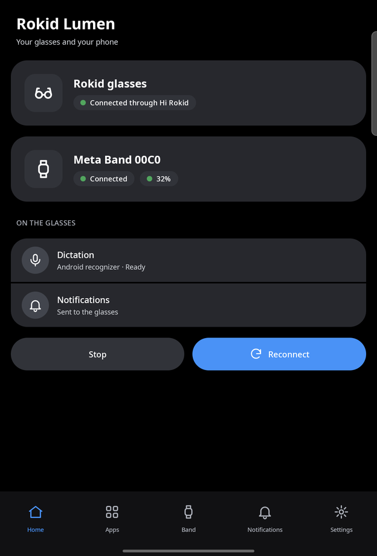
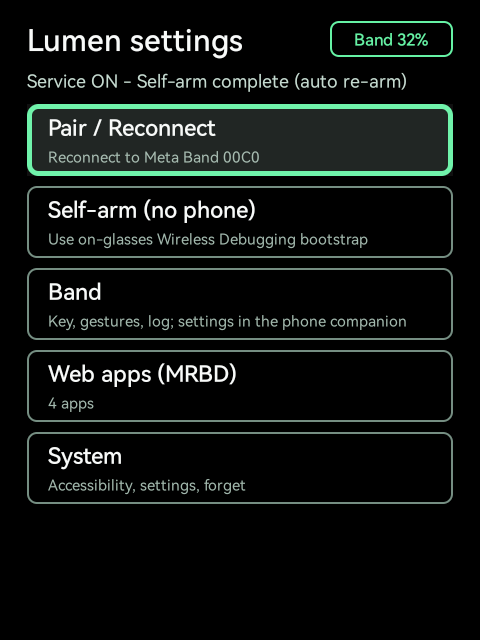

# Getting started

This guide takes you from two APKs to a band that drives the glasses. It takes about fifteen
minutes, most of it spent on the band's key and the self-arm.

## Requirements

- **Rokid RG glasses** (YodaOS-Sprite, Android 12, a 480x640 monochrome green HUD), set up with
  the Hi Rokid app. The glasses app needs Android 10 (API 29) or later, and the self-arm needs
  Android 11 (API 30) or later; the RG glasses' Android 12 meets both.
- **A Meta Neural Band**. The companion claims it with your Meta account (step 3), as
  [kinesis](https://github.com/callbacked/kinesis) and
  [air-gestures](https://gitlab.com/896kb/air-gestures) do; a band already claimed with
  air-gestures works too, through its `air-gestures-band.json` file. Claiming the band unlinks it
  from Meta's glasses and app, and the link is unofficial: a band firmware update, or a change in
  Meta's sign-in routes, could break it.
- **An Android phone with Android 12 (API 31) or later**, with the Hi Rokid app installed,
  signed in and connected to the glasses. The companion's Rokid SDK (CXR-L) needs API 31.
- **No computer**: the companion installs the glasses app over Rokid's link (step 1), claims
  the band and hands its key to the glasses (step 3). Turn on USB debugging for the glasses in
  the Hi Rokid app's developer settings: the self-arm needs it.
- **A Wi-Fi network the glasses can join**, for the self-arm. Android's Wireless debugging
  only works on Wi-Fi.

## 1. Install the companion; it installs the glasses app

Download `rokid-lumen-companion-<version>.apk` from the
[GitHub Releases](https://github.com/beyondlevi/rokid-lumen/releases) page (check it against
`SHA256SUMS.txt`) and install it on the phone, as any APK.

Open it: the Home tab shows **Set up your glasses**. The setup page takes four steps, all from the
phone:

1. **Authorize in Hi Rokid** (step 2 below explains what it asks for).
2. **Turn on the phone's Wi-Fi**: the glasses app travels to the glasses over Wi-Fi.
3. **Install on the glasses**: the companion downloads the latest release's glasses APK from
   GitHub, checks its digest and that it's signed with the companion's key, and hands it to
   Rokid's link (CXR-L `appUploadAndInstall`), as Rokid Nexus does. It takes under a minute.
4. **Turn Lumen on, on the glasses**: the companion opens Lumen's setup on the glasses, which
   opens Settings > Accessibility there. With the touchpad, open **Rokid Lumen** and turn it on.
   Only a person can turn on an accessibility service; it is the one step done on the glasses.
   The page turns green when the glasses app answers the phone.

Updates come the same way afterwards (Settings > Updates).

With a computer instead:

```sh
sha256sum -c SHA256SUMS.txt
adb -s <glasses> install rokid-lumen-glasses-<version>.apk
adb -s <phone> install rokid-lumen-companion-<version>.apk
```

Never force-stop the glasses app (`am force-stop`, `am start -S`, or *Force stop* in the app's
settings): the firmware then drops its accessibility service and the band with it.

## 2. Authorize the companion in Hi Rokid

Open **Rokid Lumen Companion** on the phone. It asks for its permissions on first start:
allow them. *Nearby devices* covers Bluetooth (the band, if you use it on the phone) and the
local-only hotspot that gives the glasses internet; notifications are for its foreground
service, "Link to the glasses".

1. On the Home tab, tap **Authorize in Hi Rokid** and accept in Hi Rokid. The companion asks
   Hi Rokid for the link to the glasses and for the glasses' microphone (for dictation). If
   it says the authorization wasn't completed, sign in to Hi Rokid and try again.
2. On the Notifications tab, allow **Notification access** if you want the phone's
   notifications on the glasses. **Send a test notification** checks the whole path.
3. On the Settings tab, under Dictation, pick an engine. The default, the Android recognizer,
   needs the phone's microphone permission (it is fed the glasses' audio). The cloud engines
   need an API key; Vosk downloads its offline model on first use.

The link comes back by itself after the phone reboots.

<!-- media: companion-home -->


## 3. Give the glasses the band's key

**With your Meta account, from the phone.** In the companion's setup page (Settings > Glasses
setup) or on the Band tab, tap **Generate the key with my Meta account**:

1. Factory reset the band first: hold its button for about 16 seconds (holding it 3 seconds
   only starts pairing mode, which isn't enough). It then waits in pairing mode; keep it near
   the phone. This unlinks it from Meta's app and glasses, and any key you had for it stops
   working. A band that wasn't reset shows up but turns the connection down: the claim stops
   after a few attempts and asks for the reset.
2. Sign in on Meta's own page, which opens in the companion (your password and two-factor code
   stay on Meta's page; the companion keeps only the session it needs, in memory, for this
   claim).
3. The companion finds the band, asks Meta to make this phone its owner, and stores the band's
   new key. It then sends the key to the glasses (as **Send the key to the glasses** below). The
   claim itself takes a few seconds (measured: 8 s); with the sign-in, about a minute.
4. Pair the band with the glasses (step 4): it's bonded to the phone now, so put it in pairing
   mode once more (hold its button 3 seconds) near the glasses. The glasses forget their bond
   to the band from before the reset by themselves.

Debug builds also have **Test the sign-in and the band (no claim)**: it signs in and reads the
band's serial, then stops before anything goes to Meta. A band that wasn't reset passes it too.

Keep a copy of the key (Band tab, **Export the key**) if you also want to use the band from a
computer.

**With a key from air-gestures** (a band you already claimed on a computer):

1. Claim the band with air-gestures (`air-gestures pair`) and export its key
   (`air-gestures export`). You get `air-gestures-band.json`. Anyone holding that file controls
   the band: keep it private.
2. Free the band: it talks to one device at a time. Run `air-gestures disconnect` on the
   computer.
3. **From the phone, no cable**: put the file on the phone, then in the companion's setup page
   (Settings > Glasses setup) tap **Import the key file** and **Send the key to the glasses**
   (or Band tab > **Send the key to the glasses**). The key goes over Rokid's link and the
   glasses import it as below; the band link starts over with it. Skip steps 4 and 5.

   With a computer instead, copy the file to the glasses:

   ```sh
   scripts/push-band-file.sh air-gestures-band.json
   ```

   It lands in `/sdcard/Android/data/dev.lumen.glasses/files/`.
4. (Computer only) On the glasses, open Rokid Lumen from the Rokid launcher. The apps grid opens; allow the
   Bluetooth permission when asked. Go to the grid's last item, **Settings**, then **Band >
   Import band key**. The app copies the key into its private storage and deletes the file
   from that folder.

The companion can import the same file (Band tab, **Import the key**) if you also want to use
the band on the phone.

## 4. Enable the accessibility service and pair the band

Until the band is connected, move through the glasses' screens with the touchpad.

1. In Settings, open **System > Accessibility** and enable **Rokid Lumen**. The band link
   lives in this service: it starts as soon as the service runs.
2. Put the band in pairing mode (hold its button for 3 seconds) and select **Pair /
   Reconnect** on the Settings home screen. Keep the glasses' display on meanwhile: Android
   pauses the search for the band while the display is off. The status line shows *Waiting for the band*,
   *Connecting to the band*, then *Band connected*. Once bonded, the band reconnects on its
   own, without pairing mode.
3. **Band > Gesture guide** lists what each gesture does. The rest of the band's settings
   (the index double tap, pinch and turn, the wrist, power saving) are in the companion's Band
   tab.

## 5. Run the self-arm

**From the phone**: in the companion's setup page, step **Prepare the glasses**. First, in Hi
Rokid, turn on USB debugging (developer settings) and connect the glasses to a Wi-Fi network;
then tap **Prepare**. The glasses wake their display and run the same self-arm as below; its
steps show on the phone, and the page says when they're armed (about 20 s, measured). The
glasses' Settings row described below does the same on the glasses.


The Rokid firmware force-stops the app in front and strips its accessibility service when a
temple is folded or the glasses sleep, and the band goes with it. The self-arm gives the app
the shell privileges it needs to put itself back, and to join the phone's hotspot later.

Before you start: the accessibility service must be on, and Rokid Nexus must not be installed
(it manages ADB on the glasses itself; the self-arm stops and says *Self-arm off: Nexus
manages ADB here*).

1. In Settings, select **Self-arm (no phone)**. From here the app works on its own, through
   the accessibility service. Don't touch the glasses until it ends (up to 75 seconds).
2. It turns Wi-Fi on (*Self-arm: enabling Wi-Fi*) and opens the system Settings.
3. If Developer options are off, it opens the device information screen and taps the build
   number to turn them on (*Self-arm: tapping build number*).
4. It opens Developer options, then **Wireless debugging**, switches it on and confirms
   (*Self-arm: turning Wireless Debugging on*).
5. It opens **Pair device with pairing code**, reads the code and the port from the screen
   (*Self-arm: pairing code ready*), and pairs with the glasses' own adbd over 127.0.0.1
   (*Self-arm: pairing local ADB*).
6. Over that ADB session it installs and starts the two shell helpers, grants itself
   `WRITE_SECURE_SETTINGS`, turns USB debugging on, restarts adbd on TCP port 5555, and turns
   Wi-Fi off again about 12 seconds later.
7. The status line reads **Self-arm complete**.

<!-- media: settings-self-arm -->


If it stops with a message, these are the common ones:

| Status line | What to do |
| --- | --- |
| *Enable USB debugging in Hi Rokid settings* | Turn on USB debugging for the glasses in Hi Rokid's developer settings, then select Self-arm again. |
| *Self-arm needs developer options* | Turn on Developer options by hand (tap the build number seven times), then run it again. |
| *Self-arm needs a Settings tap* | Settings showed something the app didn't recognise. Open Wireless debugging by hand and run it again. |
| *Self-arm failed: Wi-Fi did not turn on* | Turn Wi-Fi on and make sure a saved network is in range. |
| *Self-arm failed: pairing code expired* or *setup timed out* | Run it again. |
| *Service STUCK* | Settings shows the service on while it isn't running. The watchdog and the app repair it on their own. |

## What the self-arm leaves enabled

After the self-arm, and across reboots:

- **ADB over TCP on port 5555.** `persist.adb.tcp.port` is set to 5555 and USB debugging is
  on, so adbd starts at every boot and listens on port 5555 on every network interface, not
  only on 127.0.0.1. It still requires an authorized ADB key, but it is an exposed service on
  any Wi-Fi the glasses join. See [security.md](security.md).
- **The paired ADB key never expires.** `adb_allowed_connection_time` is set to 0 (Android
  revokes Wireless debugging keys after 7 days by default). The key is in the app's private
  storage.
- **`WRITE_SECURE_SETTINGS`** is granted to Rokid Lumen, which uses it to keep its
  accessibility service enabled and USB debugging on.
- **Two shell helpers** run as the `shell` user, started again by the app after each boot
  (from the boot receiver, the accessibility service and every app launch) over
  127.0.0.1:5555:
  - an **accessibility watchdog** (`/data/local/tmp/lumen-a11y-watchdog.sh`), which checks every
    second that the service is enabled and the app is running, and otherwise re-enables the
    service and relaunches Rokid Lumen, then returns to the Rokid launcher;
  - a **shortcut bridge** (`/data/local/tmp/lumen-shortcut-bridge.sh`), which takes requests
    from a file under `/sdcard/Android/data/dev.lumen.glasses/files/shortcut_bridge/`: press the
    touchpad's real Hi Rokid shortcut key, or turn Wi-Fi on or off.
- **Always-on Wi-Fi scanning is off** (`wifi_scan_always_enabled` set to 0).
- **The shell route for Wi-Fi.** With the self-arm, the app can run shell commands over
  loopback. It uses them to turn Wi-Fi on, join the phone's hotspot and forget it afterwards.

## Undo the self-arm

There is no switch in the app to undo it yet. While Rokid Lumen is installed and armed it
restarts the helpers on its next launch, so undoing it means removing the app (or clearing its
data, which also deletes the band's key and the web apps). With adb connected to the glasses:

```sh
# Stop the helpers and remove their files.
adb shell sh /data/local/tmp/lumen-a11y-watchdog.sh stop
adb shell sh /data/local/tmp/lumen-shortcut-bridge.sh stop
adb shell 'rm -f /data/local/tmp/lumen-*'

# Remove the app: its key, its WRITE_SECURE_SETTINGS grant and its files go with it.
adb uninstall dev.lumen.glasses

# Put ADB back as it was.
adb shell "setprop persist.adb.tcp.port ''"
adb shell settings delete global adb_allowed_connection_time
adb shell settings put global adb_wifi_enabled 0
adb shell settings put global wifi_scan_always_enabled 1   # if you had it on before
```

Then, on the glasses, open Developer options and **Revoke USB debugging authorizations**, and
reboot so adbd stops listening on port 5555. Turn USB debugging off in Hi Rokid if you don't
need it.

## Next

- [features.md](features.md): everything the band, the grid and the companion do.
- [building-apps.md](building-apps.md): write your own web app for the glasses.
